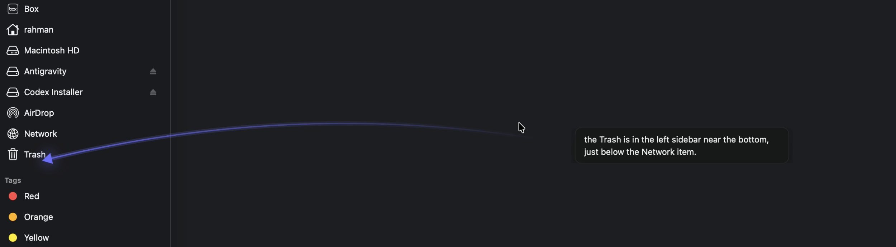

# Narrait

AI-powered assistive companion for disabled users navigating computers. Hold a key — Narrait reads the screen, explains what's in front of you, and points to what you need to click. It also agentically plans multi-step tasks as necessary - and assists you until you get to your end goal.



---

3rd place winner - 3x Nvidia Jetson Orin Nano

[Link to Devpost and Video](https://devpost.com/software/celsius?_gl=1*1r4wt7d*_gcl_au*MTU4NDQ4Mjg5NC4xNzc3NDMwNDQx*_ga*MTE2MTY0MjE3Ni4xNzc3NDMwNDQx*_ga_0YHJK3Y10M*czE3Nzc4MzcwMjIkbzgkZzEkdDE3Nzc4MzgzNzckajU5JGwwJGgw)

---

## Quick Start

**Requirements:** macOS 14.2+, Xcode 15+

```bash
# 1. Clone
git clone <your-repo-url> && cd narrAIt

# 2. API keys
cp .env.example Narrait/.env
# edit Narrait/.env → fill in ANTHROPIC_API_KEY, GEMINI_API_KEY, GROQ_API_KEY

# 3. Your Team ID (find at developer.apple.com/account → Membership → Team ID)
cp Local.xcconfig.example Local.xcconfig
# edit Local.xcconfig → set DEVELOPMENT_TEAM = YOUR_TEAM_ID

# 4. Open in Xcode
open Narrait.xcodeproj
```

**In Xcode:**
1. Right-click the `Narrait` folder → **Add Files to "Narrait"** → select `Narrait/.env` → ✅ "Add to target: Narrait" → **Add**
2. Make sure your Apple ID is in Xcode → Settings → Accounts (free account is fine)
3. Select scheme **Narrait** + destination **My Mac** → **⌘R**

**First launch:** approve Screen Recording, Accessibility, and Microphone prompts when they appear.

---

## Usage

The app lives in the **menu bar** — no Dock icon.

| Hotkey | Action |
|--------|--------|
| Press/hold **⌥ Option** | Captures your screen → Gemini explains what's under your cursor |
| Hold **⌘⌥ Cmd+Option** | Records your voice → Gemini Flash answers general questions or routes pointing to Claude Sonnet |
| Release **⌘⌥ Cmd+Option** | Stops voice recording |

Click the menu bar icon to switch access profiles or update API keys.

---

## API Keys

| Key | Get it from |
|-----|-------------|
| `ANTHROPIC_API_KEY` | [console.anthropic.com](https://console.anthropic.com/) |
| `ANTHROPIC_MODEL` | Pointing model, e.g. `claude-sonnet-4-6` |
| `GEMINI_API_KEY` | [aistudio.google.com](https://aistudio.google.com/) |
| `GEMINI_ROUTER_MODEL` | Router model, e.g. `gemini-3-flash-preview` |
| `GROQ_API_KEY` | [console.groq.com/keys](https://console.groq.com/keys) |

> **Note:** Computer Use is beta; Narrait chooses the matching Anthropic beta header for the configured Claude model.

---

## Tech Stack

| Layer | Technology |
|-------|-----------|
| Language / UI | Swift 5.9, SwiftUI + AppKit |
| Vision + Reasoning | Gemini Flash (`GEMINI_ROUTER_MODEL`) for hover/general answers + Claude Sonnet Computer Use (`ANTHROPIC_MODEL`) for precise pointing |
| Speech → Text | Groq Whisper Large v3 (batch REST, ~180ms) |
| Text → Speech | Gemini 3.1 Flash TTS Preview (`gemini-3.1-flash-tts-preview`) |
| Screen capture | ScreenCaptureKit (`SCScreenshotManager`) |
| Global hotkeys | CGEventTap (listen-only, no interception) |
| Key storage | Bundled `.env` loaded into `UserDefaults` at launch |
| API call logging | JSON files in `~/Library/Logs/Narrait/` |

---

## Architecture

Single orchestrator (`ActivationCoordinator`) owns the state machine. All API clients and UI components are injected as dependencies — they never call each other.

```
idle ──hold Option──▶ capturing ──▶ streaming ──▶ playing ──▶ idle
idle ──hold Cmd+Opt─▶ recording ──▶ transcribing ──▶ streaming ──▶ playing ──▶ idle
any  ──release key──▶ cancel in-flight ──▶ idle
```

### Hover-explain flow

1. User holds **Option**. `GlobalHotkeyMonitor` waits 150ms to confirm it's not a Cmd+Option chord.
2. `ScreenCapture` grabs all displays via `SCScreenshotManager`, sorted cursor-screen first, downscaled to max 1280px.
3. Gemini Flash sends screenshot(s) + cursor position + system prompt + conversation history.
4. `ResponseOverlay` (cursor-following `NSPanel`) renders the text in real time.
5. Full response is parsed for a `[POINT:y,x:label]` tag if Gemini includes one.
6. `GeminiTTSClient` speaks the response via `AVAudioPlayer`.
7. On key release: in-flight requests cancel, overlay fades after 3s.

### Voice flow

1. User holds **Cmd+Option** → mic recording starts via `MicRecorder` (AVAudioEngine, 16kHz PCM16).
2. Key release → `MicRecorder.stop()` returns WAV data → `GroqWhisperClient` transcribes.
3. Transcript + fresh screen capture → Gemini Flash router answers general screen questions directly.
4. If the router says the user needs a visible location or action target, Sonnet Computer Use receives the same screen and returns the point for the green marker.

### Cursor pointing

Sonnet Computer Use returns a `mouse_move` coordinate only for action/location requests. Coordinates are in submitted screenshot-pixel space; `handlePointTo` converts them to AppKit global screen coords accounting for multi-display layout and Retina scaling.

- All profiles: green marker appears at the target
- Narrait does not move the physical mouse

### Access profiles

Four profiles (Default, Blind / Low Vision, Dyslexia, Language Support). Each appends a clause to the system prompt and sets a TTS speed when needed. Persisted in `UserDefaults`. Selectable from the menu bar.

### Conversation memory

`ConversationStore` keeps the last 6 turns (user text + assistant response). Sent with every request for follow-up context. Auto-clears after 30 seconds of inactivity.

### API logging

Every API call is appended to a JSON file in `~/Library/Logs/Narrait/`:

- `gemini.json` — model, system prompt, history, user prompt, image count, output, input/output tokens, duration
- `groq.json` — model, audio size, transcript, audio duration, duration
- `gemini_tts.json` — model, voice ID, input text, character count, speed, audio size, duration

---

## Project Structure

```
Narrait.xcodeproj
Narrait/
  NarraitApp.swift               # @main entry, builds dependency graph, requests permissions
  Info.plist                     # LSUIElement=true, usage description strings
  Narrait.entitlements           # sandbox=false, network, audio-input

  Core/
    ActivationCoordinator.swift  # State machine, orchestrates all components
    ScreenCapture.swift          # SCScreenshotManager, multi-display, Retina coords
    GlobalHotkeyMonitor.swift    # CGEventTap, Option + Cmd+Option with debounce
    AccessProfile.swift          # Enum, UserDefaults persistence, profile-specific TTS speed
    ConversationStore.swift      # 6-turn rolling history, 30s idle expiry
    SystemPrompts.swift          # Locked rubric + per-profile clauses
    KeychainStore.swift          # .env loader → UserDefaults
    APILogger.swift              # Append-only JSON logs per API

  API/
    GeminiClient.swift           # Gemini 2.0 Flash SSE streaming, [POINT:] tag parsing
    GroqWhisperClient.swift      # Whisper Large v3 multipart POST
    CartesiaTTSClient.swift      # Gemini TTS REST → WAV → AVAudioPlayer

  UI/
    MenuBarController.swift      # NSStatusItem, profile picker menu, key entry
    ResponseOverlay.swift        # Cursor-following NSPanel, streaming text, auto-resize
    CursorPointer.swift          # Highlight ring NSPanel, cursor warp

  Audio/
    MicRecorder.swift            # AVAudioEngine 16kHz PCM16, WAV export
    AudioPlayer.swift            # AVAudioPlayer wrapper with stop/stopHard
```

---

## Why Narrait

**Guidance, not automation.** Competitors like Cluely do things *for* you. Narrait teaches you to do them *yourself*. Screen readers don't read books for you — they give you access to read. Narrait doesn't navigate VS Code for you — it shows you *how*, so next time you don't need it.

**Cost.** ~$0.003/call with Gemini 2.0 Flash + billing enabled. Competitors charge $20–30/month subscriptions — out of reach for most students on financial aid. Narrait is pay-as-you-go.

**Not an AI assistant. An assistive AI.** The system prompt has a hard rubric: describe the screen, translate jargon, walk through software, complete non-graded forms. It refuses to interpret academic content (math problems, essay prompts, code assignments). The refusal isn't keyword-based — it's content-type-based. Hover a math problem and ask "what's the answer" → refusal. Hover a confusing FAFSA field → full plain-English explanation.
